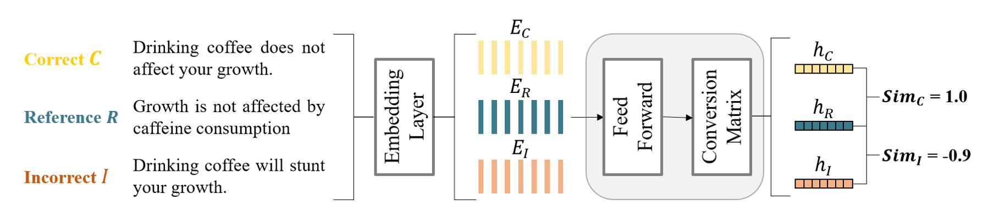

# MATCHA — Matching Text via Contrastive Semantic Alignment

MATCHA (Matching Text via Contrastive Semantic Alignment) is a learned text similarity metric that captures both semantic alignment and contradiction through contrastive training. Unlike traditional lexical metrics (e.g., ROUGE) or embedding-based methods (e.g., BERTScore), MATCHA learns a dual-view semantic space in which semantically aligned texts are pulled closer while contradictory or irrelevant texts are pushed apart. This enables more accurate, robust, and human-aligned similarity scoring across a wide range of NLP tasks.

**Paper:** [MATCHA: Matching Text via Contrastive Semantic Alignment](https://arxiv.org/abs/2605.27345) | **Model:** [HuggingFace](https://huggingface.co/Siran-Li/MATCHA)



## Project Structure

```
MATCHA/
├── model.py                    # Core model: ContrastiveModel, SenseNetwork, NoMixBlock, MLP
├── train_seq.py                # Sequential (standard) training loop
├── train_curriculum.py         # Curriculum learning (easy → hard progression)
├── train_interleaved.py        # Interleaved training (balanced multi-source sampling)
├── eval_matcha.py              # Evaluation on 7 benchmark datasets
├── requirements.txt            # Python dependencies
├── configs/
│   ├── gpt2-small.yaml         # Training hyperparameters
│   ├── gpt2small.json          # Model architecture config
│   └── mixed.json              # Dataset definitions (15 sources with difficulty levels)
├── dataset/
│   ├── dataset_contrastive.py  # ConDataset — loads triplets from pickle (evaluation)
│   ├── dataset_streaming.py    # StreamingDataset & InterleavedBatchLoader (parquet-based)
│   ├── dataset_interleave.py   # Alternative interleaved dataset implementation
│   └── dataset_curriculum.py   # StreamingCurriculumDataset (difficulty-aware loading)
├── dataset_process/
│   ├── prepare_eval_datasets.py   # Converts raw eval data → pickle triplets
│   ├── prepare_train_datasets.py  # Converts raw train data → parquet
│   └── prepare_train_mixed.py     # Merges sources into mixed.parquet + index_by_source.json
├── baselines/
│   ├── eval_baselines.py       # Compare MATCHA against 8 baseline metrics
│   └── human_eval.py           # Correlation analysis with human judgments
└── interpret/
    └── captum_interpret.py     # Token-level attribution via Integrated Gradients
```


## Installation

```bash
pip install -r requirements.txt
```


## Data Pipeline

Data preparation and preprocessing utilities are provided in `dataset_process/`. Please refer to this directory for details on how datasets are constructed and formatted for training and evaluation.


## Training

Three training paradigms are available, all using triplet margin loss with cosine similarity and distributed training via HuggingFace Accelerate.

### Sequential Training 

Standard single-epoch streaming over a mixed dataset with periodic validation.

```bash
accelerate launch train_seq.py 
```

### Curriculum Learning 

Progressively increases difficulty over epochs. Datasets are assigned difficulty levels 1–5 in `configs/mixed.json`, and the curriculum advances based on epoch progress.

```bash
accelerate launch train_curriculum.py
```

### Interleaved Training 

Round-robin batch sampling across data sources using a pre-built source index (`index_by_source.json`), ensuring balanced exposure.

```bash
accelerate launch train_interleaved.py 
```


## Evaluation

### MATCHA Evaluation

Evaluates trained checkpoints on 7 benchmarks using triplet-based and pairwise evaluation:

```bash
python eval_matcha.py --output-path path/to/run_directory
```

**Triplet evaluation:** SNLI, MultiNLI, MedNLI, TruthfulQA, COCO-Caption, NEWTS

**Pairwise evaluation:** Climate-FEVER (threshold-based F1)

Metrics reported: loss, positive/negative similarity (mean ± std), difference, F1 score.

### Baseline Comparison 

```bash
python baselines/eval_baselines.py 
```

Compares MATCHA against 9 widely used baseline metrics:

| Metric | Description |
|--------|-------------|
| ROUGE (R1, R2, RL) | N-gram overlap-based similarity |
| METEOR | Alignment-based metric with synonym matching |
| EmbSim | Cosine similarity using sentence-transformer embeddings |
| BERTScore | Token-level similarity using contextual BERT embeddings |
| BLEURT | Learned evaluation metric fine-tuned on human judgments |
| SimCSE | Contrastive sentence embedding similarity |
| MAUVE | Distribution-based metric for text generation quality |
| MATCHA | Token-grounded contrastive semantic alignment (proposed method) |

Reports macro F1, Wasserstein distance, and balanced accuracy per dataset and cross-dataset.

### Human Evaluation 

```bash
python baselines/human_eval.py
```

Correlates metric scores with human judgments on SNLI, MultiNLI, and TruthfulQA. Produces:
- Concordance correlation coefficient heatmaps
- Ranking analysis (R@1, DCG)
- Score distribution plots

## Interpretability

Token-level attribution analysis using Integrated Gradients (via Captum):

```bash
python interpret/captum_interpret.py
```

Analyzes which tokens contribute most to similarity scores for EmbSim, BERTScore, BLEURT, SimCSE, Mistral-7B, and MATCHA. Outputs token attribution JSON and interactive HTML visualizations.

## Citation

Please cite our paper if you use MATCHA in your work:

```bibtex
@inproceedings{li2026matcha,
  title={MATCHA: Matching Text via Contrastive Semantic Alignment},
  author={Li, Siran and Etoglu, Ece Sena and Eickhoff, Carsten and Bahrainian, Seyed Ali},
  booktitle={Findings of the Association for Computational Linguistics: ACL 2026},
  pages={21001--21018},
  year={2026}
}
```