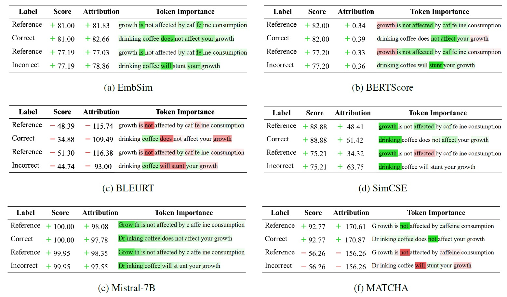

# Interpretability

Token-level attribution analysis using Integrated Gradients (via Captum) for EmbSim, BERTScore, BLEURT, SimCSE, Mistral-7B, and MATCHA.

```bash
python interpret/captum_interpret.py --output-path <MATCHA_CHECKPOINT_DIR>
```


